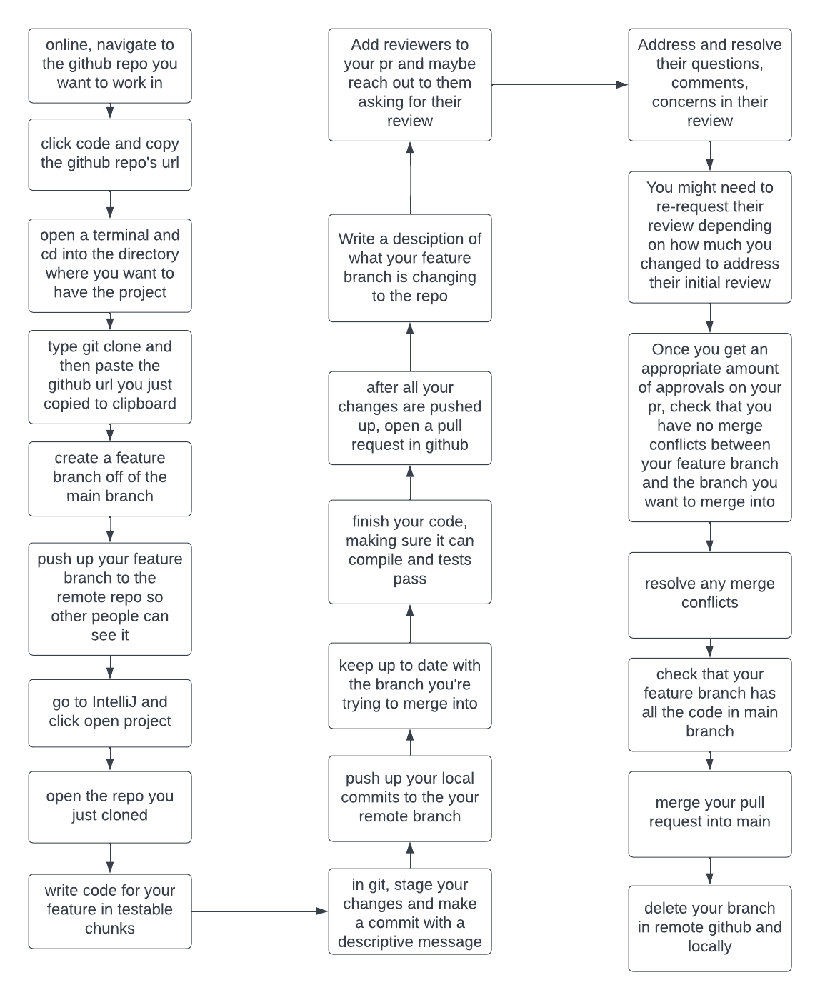

# Github-CI Workflow
## GP #0 for CS113 - Javadoc

>This walks through how to write code on a team using git and an IDE, like IntelliJ

### Project Deliverables:
1. online, navigate to the github repo you want to work in
2. click the code button and copy the github repo's url
3. open up a terminal on your local computer.  cd into the directory where you want to have the project
4. type git clone and then paste the github url you just copied to your clipboard
```
cd myProjects
git clone https://github.com/Moezzi-CS/cs113-gp0-javadoc-team-7-arroyo-mendiola.git
```
5. create a feature branch off of the main branch you just pulled down
```
git checkout -b my-feature-branch
```
6. you now have a feature branch locally, where only you can see it.  Push it up to the remote repo, so teammates can also see your branch.
```
git push -u origin my-feature-branch
```
7. navigate to the IntelliJ IDE and click open project
8. open the repo you just cloned
	- if you encounter errors with JUnit tests, click on the import error, then tap the alt + Enter key and click OK
9. write code for your feature in testable chunks
10. every time you make a good step in progress, stage and commit your changes.  
```
git add .
git commit -m "descriptive commit message"
```
11. push up your local commits to your remote branch
```
git push
```
12. keep up to date with the branch you're trying to merge into
```
git checkout main
git pull
git checkout my-feature-branch
git merge main
```
13. while you're staying up to date, you might need to resolve merge conflicts where you'd decide which changes you want to keep - yours, main branch, or a mixture of both.
14. once you finish your code for the feature, ensure that it compiles and all tests pass
15. push your local code up to your remote branch
16. verify all the changes in your feature branch are what you intend them to be 
```
git diff
```
17. open a pull request (pr) and leave a description about what the goal of your work is
18. add reviewers to your pr and maybe reach out to them, sharing a link to the pr
19. address and resolve your reviewers' questions, comments, concerns from the review and push up those changes
20. reply to their pr comments and resolve their messages in the pr
21. you might need to re-request for their reviews depending on if they had approved it and how big your review changes are
22. double check that your feature branch has all the code that is main. The following command should return empty
```
git log my-feature-branch..main
```
23. once you get an appropriate amount of pr approvals, and github shows that you have no merge conflicts, merge your pull request into main
24. delete your branch in remote github and locally as well
```
git branch -d my-feature-branch
```

## This a generalized sequence diagram of the steps above


